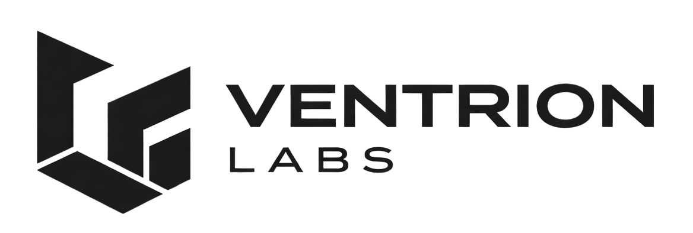

  

# Ventrion Labs

Ventrion Labs construye infraestructura digital para empresas que necesitan operar con más claridad, más control y menos fricción.

Este repositorio contiene la landing institucional de la marca, diseñada para presentar su propuesta, comunicar su enfoque y convertir visitas en conversaciones comerciales.

## La marca

Ventrion Labs se posiciona como un partner técnico para negocios reales: empresas donde la operación diaria importa, donde los procesos deben sostenerse y donde el software tiene que resolver problemas concretos, no solo verse bien.

La narrativa del sitio está construida sobre tres ideas centrales:

- excelencia operativa
- software sobrio y útil
- crecimiento con base técnica sólida

## Qué presenta esta página

La landing fue estructurada para explicar con claridad:

- qué problemas resuelve Ventrion Labs
- cómo piensa y cómo trabaja
- qué tipo de soluciones y productos puede desarrollar
- cómo iniciar una conversación comercial con la marca

## Estructura del sitio

### Home

La página principal reúne las secciones clave de la propuesta:

- hero de marca
- problemas que resolvemos
- enfoque y soluciones
- visión y valores
- proceso de trabajo
- productos
- llamado a la acción
- formulario de contacto

### Páginas institucionales

Desde el footer se enlazan páginas editoriales pensadas para dar más profundidad a la marca:

- `Nosotros`
- `Filosofía`
- `Casos de uso`
- `Privacidad`
- `Términos del sitio`
- `Aviso legal`

## Dirección visual

El sitio utiliza los assets oficiales de Ventrion Labs integrados desde `public/`, incluyendo isotipo y logotipo en variantes para fondos claros y oscuros.

La experiencia visual busca transmitir:

- sobriedad
- criterio técnico
- claridad
- una estética corporativa moderna sin exceso decorativo

## Producción y presencia pública

La página quedó preparada para salir a producción con una base sólida de presencia digital:

- identidad visual consistente
- metadata de marca
- sitemap y robots
- structured data para buscadores
- favicon y manifest
- páginas institucionales enlazadas correctamente

## Contacto

El sitio incorpora un formulario de contacto orientado a generar oportunidades comerciales.

En la etapa actual, la infraestructura quedó preparada para que los mensajes puedan ser enviados por correo usando un proveedor transaccional y un destino temporal, mientras la marca termina de consolidar su dominio y correo corporativo.

## Objetivo del proyecto

Más que una landing genérica, este sitio busca dejar una primera impresión clara sobre cómo opera Ventrion Labs:

- con foco en negocio real
- con criterio técnico
- con una propuesta seria y contemporánea

## Referencia operativa mínima

Si necesitas preparar el proyecto localmente o desplegarlo, puedes revisar:

- `.env.example`
- `.env.production.example`
- `DEPLOYMENT.md`

---

**Ventrion Labs**  
Software para la Excelencia Operativa
